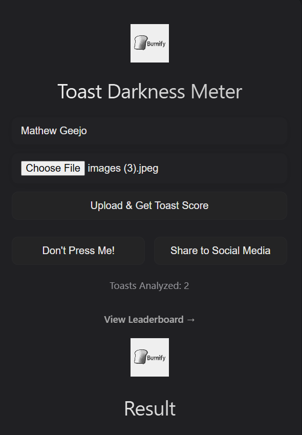
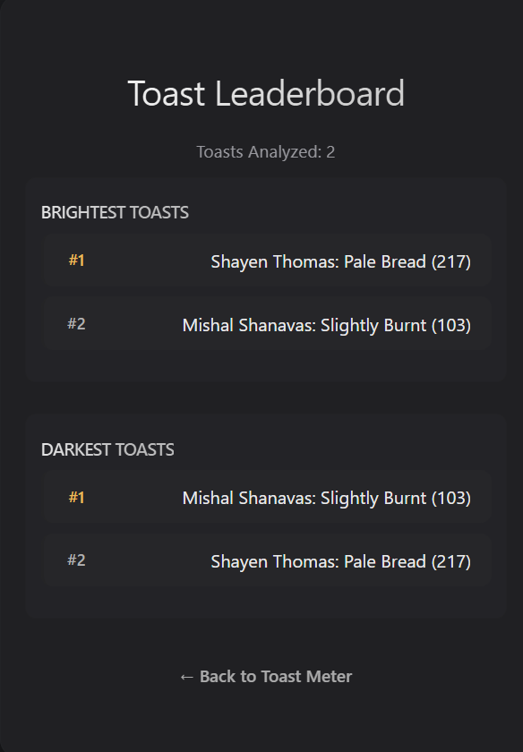

# Burnify 🎯

### Team Member
- Solo Lead: Shayen Thomas - Sahrdaya College of Engineering and Technology(Autonomous)

### Project Description
Burnify is a fun image-based tool that analyzes the darkness of toast from a photo and gives it a quirky rating — from “Lightly Kissed” to “Fully Carbonized.” It uses computer vision to measure toastiness with humor.

### The Problem (that doesn't exist)
People worldwide suffer from the eternal dilemma: Is my toast undercooked or just perfect? Without a universal toastiness standard, breakfasts are plagued by uncertainty, awkward debates, and slightly disappointing crunch levels. Burnify exists to end this crisis once and for all.

### The Solution (that nobody asked for)
Burnify swoops in like your breakfast superhero — armed with computer vision and a sharp sense of humor! Snap a pic of your toast, and Burnify’s cheeky algorithm scans every crumb to deliver an honest, hilarious toastiness verdict. No more guessing games or morning arguments — just pure, toasted truth served with a side of laughs. Because let’s face it, your toast deserves a rating as crispy as it is clever! 

## Technical Details
### Technologies/Components Used
For Software:
- [Languages used]
- [Frameworks used]
- [Libraries used]
- [Tools used]

### Implementation
For Software:
# Installation
[commands]

# Run
[commands]

### Project Documentation
For Software:

# Screenshots (Add at least 3)

*shows the toast sumbit form(home page)*

*shows leaderboard of crispiness*

*Add caption explaining what this shows*

# Diagrams

*Add caption explaining your workflow*

### Project Demo
# Video
[Add your demo video link here]
*Explain what the video demonstrates*

---
Made with ❤️ at TinkerHub Useless Projects 

