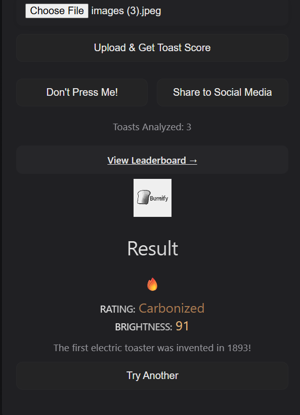

# Burnify 🎯


### Team Member
- Solo Lead: Shayen Thomas - Sahrdaya College of Engineering and Technology(Autonomous)


### Project Description
Burnify is a fun image-based tool that analyzes the darkness of toast from a photo and gives it a quirky rating — from “Lightly Kissed” to “Fully Carbonized.” It uses computer vision to measure toastiness with humor.

### The Problem (that doesn't exist)
People worldwide suffer from the eternal dilemma: Is my toast undercooked or just perfect? Without a universal toastiness standard, breakfasts are plagued by uncertainty, awkward debates, and slightly disappointing crunch levels. Burnify exists to end this crisis once and for all.

### The Solution (that nobody asked for)
Burnify swoops in like your breakfast superhero — armed with computer vision and a sharp sense of humor! Snap a pic of your toast, and Burnify’s cheeky algorithm scans every crumb to deliver an honest, hilarious toastiness verdict. No more guessing games or morning arguments — just pure, toasted truth served with a side of laughs. Because let’s face it, your toast deserves a rating as crispy as it is clever! 

## Technical Details
Software Tools:
- Python
- Flask
- OpenCV, Requests, Pillow
- Vercel, Git, pip


# Run
To run the project locally, execute the following command in your terminal:
1. Clone the repository:
   ```bash
   git clone https://github.com/shayen71421/burnify
   cd burnify
   ```

2. Install dependencies:
   ```bash
   pip install -r requirements.txt
   ```

3. Run the app:
   ```bash
   python app.py
   ```

4. Open your browser and navigate to:
   ```
   http://localhost:5000/
   ```


### Project Documentation


# Screenshots (Add at least 3)


*shows the toast sumbit form(home page)*


*shows leaderboard of crispiness*




*burnt ot not result after sumbission*


### Project Demo
# Video
https://drive.google.com/file/d/1KmC1QApS1KG-4d31p0UdhUMTJFYmo7Us/view?usp=drive_link
*Video shows to use this useless thing to view the leaderboard and get into it*


---
Made with ❤️ at TinkerHub Useless Projects 


